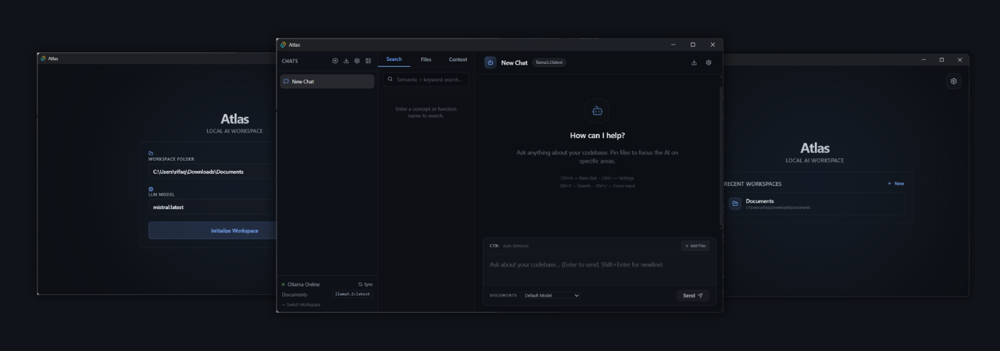

# Atlas

<div align="center">



[](package.json)
[](LICENSE)
[](https://github.com/Rifaque/atlas/actions)
[](https://ollama.com)

**The AI-First Local Workspace Assistant.**  
*Understand. Search. Build. All on your own machine.*

</div>

---

Atlas is an open-source, local-first workspace intelligence tool designed for developers who value privacy and performance. By combining high-speed Rust-based indexing with state-of-the-art Local LLMs, Atlas transforms your project folder into a searchable, queryable knowledge base.

## ✨ Core Pillars

🚀 **Privacy-First RAG**  
Your code never leaves your machine. Atlas uses a local **LanceDB** vector store and **nomic-embed-text** to index your files with zero cloud leakage.

🕸️ **GraphRAG Intelligence**  
Beyond raw vectors. Atlas uses **Tree-Sitter** to extract semantic code relationships, building a knowledge graph of your architecture for deeper reasoning.

🕒 **Timeline Intelligence**  
Ask *"What changed since yesterday?"* or *"Summarize last week's commits."* Atlas integrates directly with your filesystem and Git history to provide time-aware context.

🛡️ **Secret Shield**  
Safe cloud experimentation. If you choose to use OpenRouter, Atlas automatically scans outgoing messages for API keys or PII before they ever hit the wire.

🤖 **Agentic Design**  
Purpose-built personas (Architect, Writer, Security Auditor) equipped with bounded shell tools to help verify code and validate architecture.

---

## 🛠️ Tech Stack

Atlas is a native, high-performance desktop application:
- **Engine**: Tauri 2 (Rust)
- **Frontend**: React 18 & TypeScript
- **Intelligence**: Ollama (Inference) + Tree-Sitter (Parsing)
- **Storage**: LanceDB (Vector) + Apache Arrow

---

## 🏃 Quick Start

1.  **Download**: Grab the latest installer from [Releases](https://github.com/Rifaque/atlas/releases).
2.  **Run Ollama**: Ensure [Ollama](https://ollama.com) is running and you have pulled your models:
    ```bash
    ollama pull nomic-embed-text  # Required for indexing
    ollama pull llama3.2          # Recommended for chat
    ```
3.  **Index**: Launch Atlas, select your project folder, and start chatting.

---

## 📖 Documentation

For deep dives into the Atlas internals, refer to our consolidated documentation:

- 🎯 **[PRD](docs/prd.md)** — Product requirements and vision.
- 🏗️ **[Architecture](docs/architecture.md)** — System design and RAG pipeline details.
- 💻 **[Tech Stack](docs/tech-stack.md)** — Component-by-component technology breakdown.
- 🧠 **[Agents](agents.md)** — Documentation of our agentic personas and core intelligence.
- 🏗️ **[Development Guide](BUILD.md)** — Build instructions and platform dependencies.

---

## ⚖️ License

Atlas is released under the **MIT License**. See [LICENSE](LICENSE) for details.

*Built for the next generation of local-first development.*
